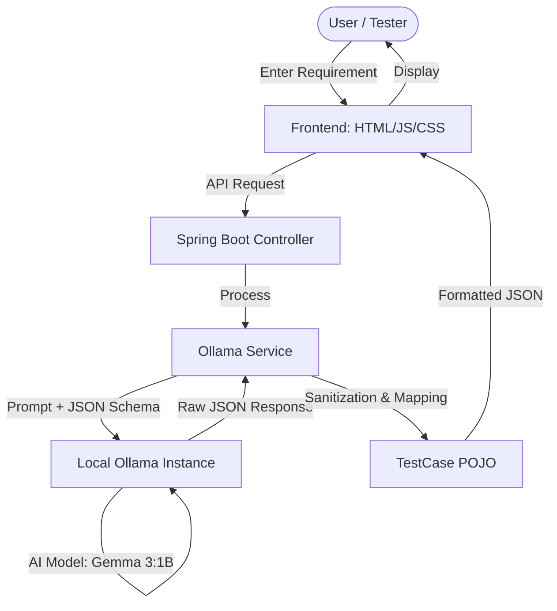

# **AI Local Test Case Generator**

An AI-powered local test case generator built with Spring Boot and Ollama (Gemma 3:1B) that transforms software requirements into structured JSON test suites automatically.

## **🏗️ System Architecture**

Below is the logical flow of the application:

### **🚀 Key Features**
*   **AI-Driven Generation**: Uses the `gemma3:1b` model (via Ollama) to interpret requirements and generate comprehensive test steps and expected results.
*   **Structured Output**: Automatically formats AI responses into a clean JSON schema including Test Suite names, IDs, Descriptions, and Step-by-Step instructions.
*   **Robust Parsing**: Implements a flexible deserialization layer with Jackson `@JsonAlias` and regex sanitization to handle various AI response formats.
*   **Local & Secure**: All AI processing happens locally on your machine—no data is sent to external clouds.

### **🛠️ Tech Stack**
*   **Backend**: Java 17, Spring Boot, Spring Web (REST API)
*   **AI Integration**: Ollama API (Local LLM orchestration)
*   **Data Handling**: Jackson (JSON processing & mapping)
*   **Frontend**: HTML5, CSS3, JavaScript (Vanilla)

### **📋 How it Works**
1. **User Input**: User enters a software requirement (e.g., "Login page with validation").
2. **AI Request**: The Spring Boot backend constructs a specialized prompt and sends it to the local Ollama instance.
3. **Processing**: The AI generates a JSON-formatted test suite.
4. **Validation**: The backend's `OllamaService` validates and cleans the JSON to ensure it matches the `TestCase` model.
5. **Results**: The frontend displays the organized test cases for the user to review.

---
*Created by SUVAM BISWAS*
